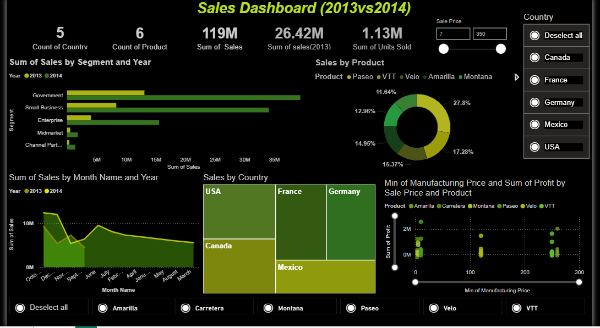

# PowerBI-Sales-Dashboard

📊 Sales Dashboard using Power BI

🔹 Overview

This project showcases an interactive Sales Dashboard developed using Power BI based on a financial Excel dataset.
The dashboard provides a clear view of sales performance, revenue trends, and profitability, helping stakeholders make data-driven business decisions.

🔹 Objective

The main objectives of this dashboard are to:

Analyze overall sales and revenue performance

Track profit trends over time

Compare sales across regions and product categories

Present key metrics in a visually clear and interactive format

🔹 Dataset

Type: Financial Sales Data

Source: Excel file (.xlsx)

Key Fields Include:

Sales Amount

Revenue

Profit

Product Category

Region

Date (Month / Year)

The dataset is used for learning and analytical purposes.

🔹 Tools & Technologies

Power BI Desktop – Data visualization and dashboard creation

Microsoft Excel – Data source

DAX – Calculated measures and KPIs

📸 Dashboard Preview

(Screenshot of the Power BI dashboard)

👉 Replace dashboard.png with your actual screenshot file name
(make sure the image is uploaded in the repository).

🔹 Dashboard Highlights

KPI cards showing Total Sales, Revenue, and Profit

Time-based analysis to observe monthly and yearly trends

Region-wise and product-wise sales comparison

Interactive slicers for dynamic filtering

Clean and professional dashboard layout

🔹 Key Insights

Certain regions contribute a significantly higher share of total revenue

Sales show noticeable trends across specific time periods

Some products generate high sales volume but comparatively lower profit margins

🔹 How to Use

Download or clone this repository

Open the .pbix file using Power BI Desktop

Refresh the data if required

Use filters and slicers to explore insights

🔹 Conclusion

This project demonstrates practical experience in Power BI reporting, data analysis, and business insight generation.
It reflects the ability to convert raw financial data into meaningful and actionable visual insights.

👩‍💻 Author

Anjali K
Aspiring Data Analyst
Skills: Power BI | Excel | SQL | Data Analysis
